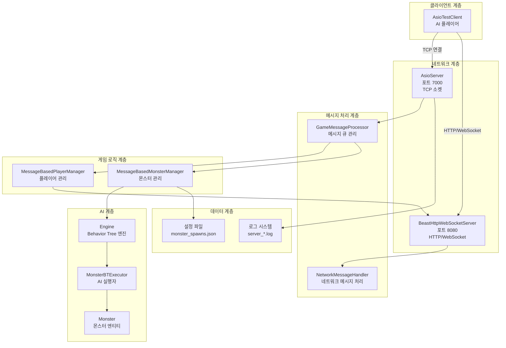
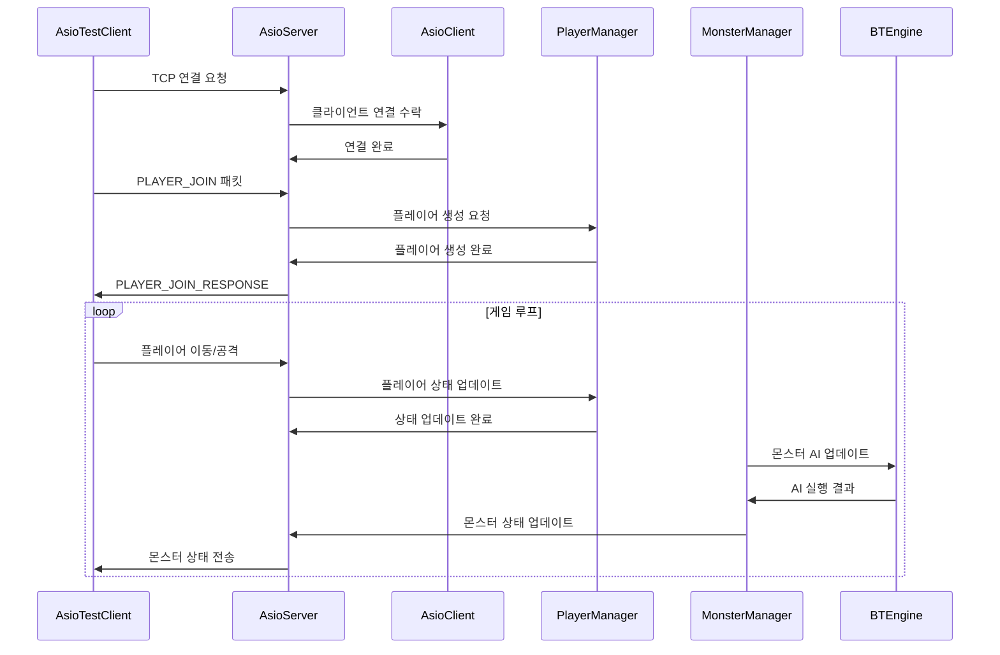
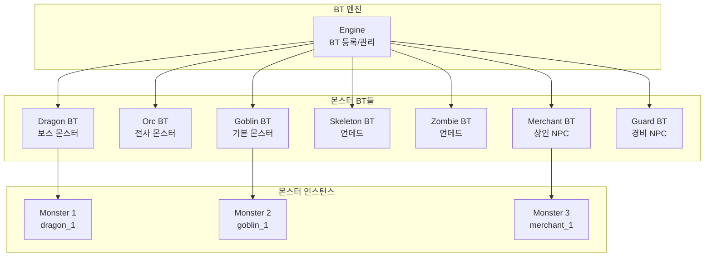
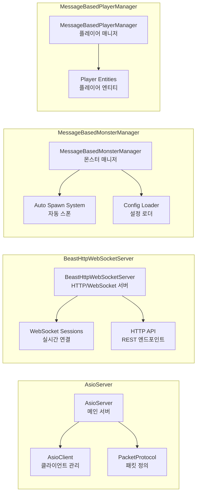
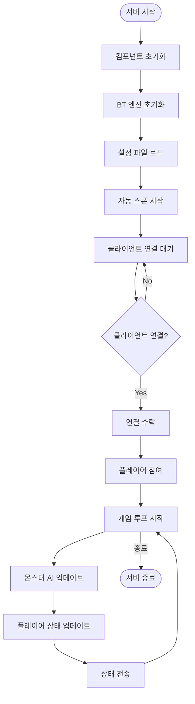
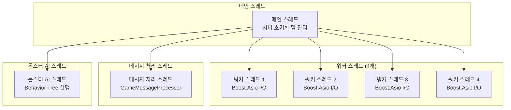
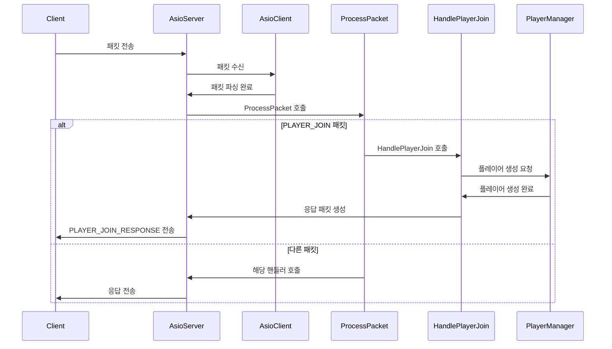
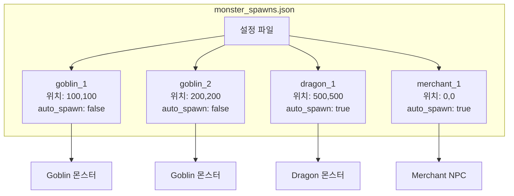

# BT MMORPG 서버 아키텍처

## 전체 시스템 아키텍처

## 네트워크 통신 흐름

## Behavior Tree AI 시스템

## 서버 컴포넌트 상세 구조

## 데이터 흐름 다이어그램

## 스레드 구조

## 패킷 처리 흐름

## 설정 파일 구조

이 다이어그램들을 통해 BT MMORPG 서버의 전체 아키텍처를 시각적으로 이해할 수 있습니다. 각 컴포넌트 간의 관계와 데이터 흐름을 명확하게 보여줍니다.
